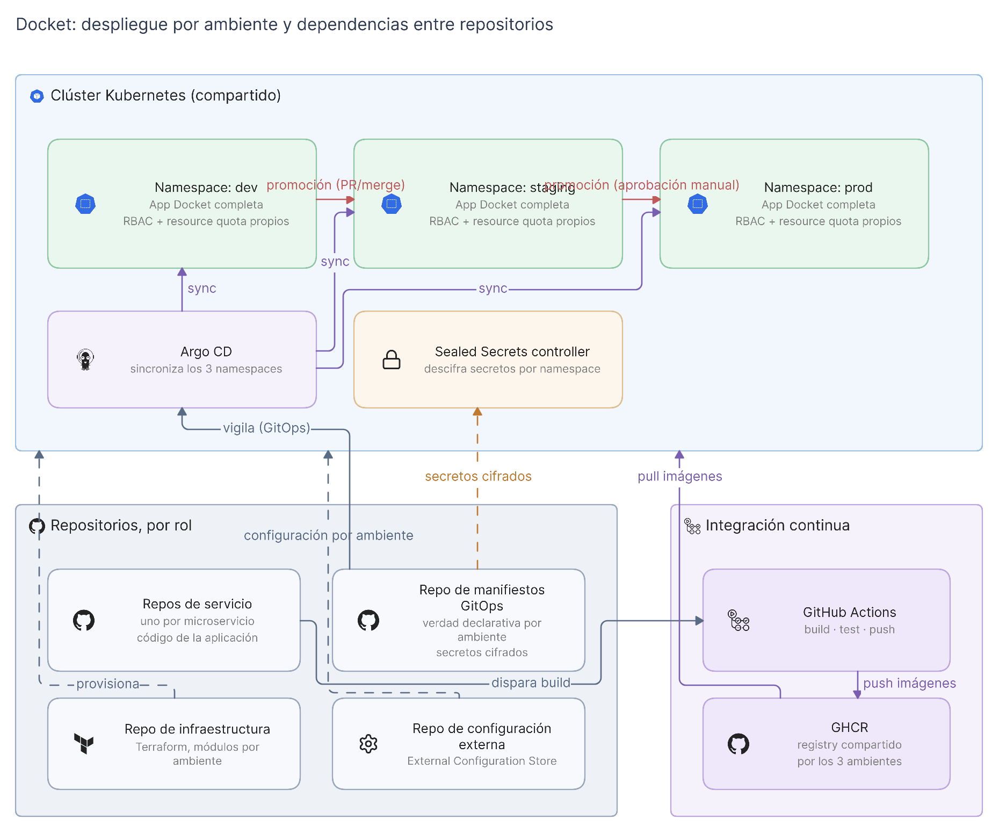

# Despliegue por ambiente

Vista de dónde corre cada cosa, qué separa un ambiente de otro y cómo avanza un
cambio hasta producción. Los componentes en sí están descritos en
[`logica.md`](logica.md).

## Topología

Un único clúster de Kubernetes compartido, con tres namespaces: `dev`, `staging`
y `prod`. Cada namespace corre una instancia completa de la aplicación: los
cinco servicios más Redis.

> La topología de un clúster compartido en lugar de tres clústers separados es
> un **supuesto todavía no confirmado**. Antes de construir infraestructura
> sobre él, lea la justificación y sus consecuencias en
> [`decisiones.md`](decisiones.md).

## Límites entre desarrollo, staging y producción

**Qué los separa.** El aislamiento es lógico, no físico. Cada namespace tiene su
propio RBAC y sus propias resource quotas, de modo que un ambiente no puede leer
los secretos de otro ni consumir sus recursos hasta dejarlo sin capacidad. Al
compartir clúster, no hay aislamiento a nivel de nodo ni de plano de control: un
incidente en el clúster afecta a los tres ambientes a la vez.

**Qué comparten.** El clúster, el registry de imágenes y la instancia de Argo
CD. Lo que cambia entre ambientes es qué versión de cada imagen está declarada
en los manifiestos, no de dónde viene esa imagen.

**Qué los conecta.** Únicamente la promoción, y siempre en un sentido:
`dev` a `staging` a `prod`. No hay tráfico entre namespaces ni acceso directo de
un ambiente a los datos de otro.

**Los controles.**

| Transición | Control |
|---|---|
| Llegada a `dev` | Automática. Se sincroniza en cuanto el manifiesto cambia en Git. |
| `dev` a `staging` | Pull request sobre el repositorio de manifiestos, con revisión. |
| `staging` a `prod` | Pull request con revisión más **aprobación manual explícita**. Ningún cambio llega a producción de forma automática. |

Cada ambiente expone su propio Ingress con TLS y su propio endpoint. El diseño
de las políticas de aprobación en la pipeline corresponde al área 04; aquí se
define el límite que esas políticas deben respetar.

## Flujo GitOps

El repositorio de manifiestos contiene la verdad declarativa de los tres
ambientes. Argo CD corre dentro del clúster, vigila ese repositorio y sincroniza
cada namespace con lo que está declarado.

La consecuencia importante: **la pipeline nunca aplica cambios al clúster de
forma directa**. GitHub Actions construye la imagen y la publica en el registry;
el despliegue solo ocurre cuando un manifiesto en Git referencia esa versión
nueva. Todo cambio en producción tiene, por construcción, un commit que lo
explica.

## Dependencias entre repositorios y ambientes

El proyecto está separando el código en varios repositorios. El diagrama los
representa **por rol y no por nombre**, porque los repositorios por
microservicio todavía no existen y su convención de nombres no está acordada
(ver [`decisiones.md`](decisiones.md)).

| Rol del repositorio | Qué aporta | Cómo llega al ambiente |
|---|---|---|
| **Repos de servicio**, uno por microservicio | Código de la aplicación | Un push dispara la pipeline, que construye la imagen y la publica en el registry |
| **Repo de infraestructura** | Terraform, con módulos por ambiente | Provisiona el clúster y los recursos que sostienen los tres namespaces |
| **Repo de manifiestos GitOps** | Estado declarativo por ambiente y secretos cifrados | Argo CD lo vigila y sincroniza cada namespace |
| **Repo de configuración externa** | Configuración de la aplicación por ambiente (External Configuration Store) | Se consume en tiempo de despliegue, separada de la imagen |

La separación tiene una consecuencia práctica: un cambio de código y un cambio
de despliegue viven en repositorios distintos y avanzan por caminos distintos.
Construir una imagen no despliega nada. Solo un cambio en el repositorio de
manifiestos mueve un ambiente.

## Gestión de secretos

Un controller de Sealed Secrets corre en el clúster. Los secretos, entre ellos
el `JWT_SECRET` que comparten Auth API, Users API y Todos API, se guardan
**cifrados** dentro del repositorio de manifiestos, y el controller los descifra
dentro de cada namespace en el momento del despliegue.

Así el flujo sigue siendo declarativo de extremo a extremo, con todo el estado
en Git, sin que ningún secreto quede en texto plano en un repositorio. Cada
namespace descifra solo lo suyo: un secreto sellado para `dev` no puede
descifrarse en `prod`.

## Qué falta para que esto sea real

Nada de lo descrito aquí está desplegado todavía. El repositorio de manifiestos
GitOps aún no existe: es la historia 06 del tablero, que depende de esta. El
clúster y sus namespaces corresponden al área 02, y se derivan de esta
arquitectura.
