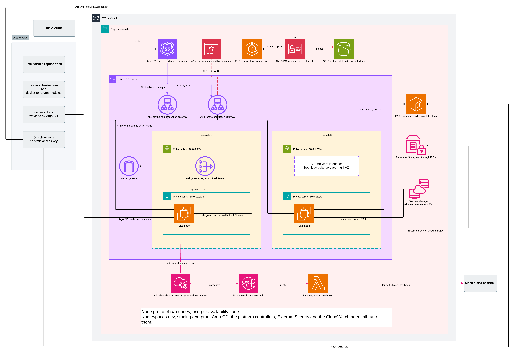

# Physical infrastructure on AWS

| | |
|---|---|
| **Purpose** | Define the physical layer Docket runs on: account, network, compute, registry, state backend, identity and secrets. |
| **Region** | `us-east-1` |



This view answers what the cluster described in [`environments.md`](environments.md) runs on. The application components are in [`logical-architecture.md`](logical-architecture.md); the decisions holding this design up are in [`decisions.md`](decisions.md).

## Budget

The account operates under the AWS free credit plan. Access to the services ends when the balance runs out or when the plan expires, without generating charges. The budget is therefore the primary design constraint.

| Item | Value |
|---|---|
| Available balance | 100 USD |
| Additional balance reachable | 100 USD for completing 5 guided activities worth 20 USD each |
| Project working window | 2 weeks |

Estimated cost of this architecture running continuously for 2 weeks (336 h) in `us-east-1`:

| Resource | Calculation | USD |
|---|---|---|
| EKS control plane | 0.10 USD/h | 33.60 |
| 2 nodes | see [Compute](#compute) | 27.95 – 64.40 |
| NAT Gateway | 0.045 USD/h plus processed traffic | 15.12 |
| Application Load Balancer | 0.0225 USD/h plus LCU | ~7.60 |
| Public IPv4 (2 for the ALB, 1 for the NAT) | 0.005 USD/h each | 5.04 |
| Node EBS (2 gp3 volumes of 20 GB) | 0.08 USD/GB-month | ~1.50 |
| S3, ECR, Route 53, Parameter Store | | ~1.50 |
| **Total, 2 weeks 24/7** | | **~92 – 128** |

**Operational implication.** With 100 USD the margin over the estimate is thin to negative. Completing the 5 activities to reach 200 USD is a practical prerequisite before applying this architecture. The RDS or Aurora instance one of the activities asks for must be deleted as soon as it is completed, because it is the only resource in that set capable of consuming credits steadily if left running.

**The saving lever.** The design is meant to be destroyed and recreated ([ADR-010](decisions.md#adr-010-ephemeral-infrastructure-with-split-state)). Shutting down outside working hours cuts the cost to less than half, and covers the FinOps stretch goal in the brief.

## Network

EKS requires subnets in at least two availability zones, so the VPC is deployed across `us-east-1a` and `us-east-1b`.

| Subnet | CIDR | AZ | Contents | Route table |
|---|---|---|---|---|
| Public A | `10.0.0.0/24` | `us-east-1a` | ALB, NAT Gateway | `0.0.0.0/0` to the Internet Gateway |
| Public B | `10.0.1.0/24` | `us-east-1b` | ALB ENI | `0.0.0.0/0` to the Internet Gateway |
| Private A | `10.0.10.0/24` | `us-east-1a` | Cluster node | `0.0.0.0/0` to the NAT Gateway |
| Private B | `10.0.11.0/24` | `us-east-1b` | Cluster node | `0.0.0.0/0` to the NAT Gateway |

The nodes live in private subnets, with no public IP and unreachable from the internet. Their egress traffic, which includes image pulls and calls to the AWS API, goes through the NAT Gateway. The only exposed component is the ALB.

**A single NAT Gateway** is deployed, in public subnet A, shared by both zones. The reference topology uses one per zone, and duplicating the component would add 15 USD over the project window. The consequence of that concession: if `us-east-1a` becomes unavailable, the nodes in `us-east-1b` lose their internet egress. See [ADR-005](decisions.md#adr-005-multi-az-network-with-a-single-nat-gateway).

### Security groups

| Security group | Ingress | Egress |
|---|---|---|
| `sg-alb` | `80/tcp` and `443/tcp` from `0.0.0.0/0` | To `sg-nodes`, on the Frontend container port |
| `sg-nodes` | From `sg-alb` on the container port, and from itself for node-to-node traffic | All |

No rule opens `22/tcp` anywhere. Administrative access is resolved through SSM. See [Administrative access](#administrative-access).

**Target registration mode.** The AWS Load Balancer Controller registers ALB targets in `ip` mode, its default behaviour on EKS, taking advantage of the AWS CNI assigning each pod a real VPC address. The ALB delivers traffic straight to the pod, without going through a NodePort or kube-proxy.

That is where the `sg-nodes` rule comes from: the port to open is the container port, and the NodePort range goes unused. If this ever changes to `instance` mode with the `alb.ingress.kubernetes.io/target-type` annotation, this rule has to be revisited.

## Compute

Amazon EKS with a managed node group of 2 nodes, one per availability zone, in the private subnets.

**Sizing.** The cluster holds three namespaces with the complete application, that is 5 services plus Redis in each, totalling 18 application pods. On top of that come Argo CD, External Secrets Operator, the AWS Load Balancer Controller and the observability stack. The constraint deciding the instance size is the pods-per-node limit the EKS CNI imposes based on available ENIs.

**A second constraint decides it in practice.** The account is on the AWS free plan, which only allows launching instance types eligible for the free tier. A type outside that list makes `RunInstances` fail in a loop with no `health.issue` reported: the symptom is an indefinite `Still creating...` and the error appears only in CloudTrail.

| Type | RAM | Pods per node | 2 nodes | USD/hour |
|---|---|---|---|---|
| `t3.small` | 2 GiB | 11 | 22 | 0.0208 |
| `c7i-flex.large` | 4 GiB | 29 | 58 | 0.0848 |
| `m7i-flex.large` | 8 GiB | 29 | 58 | 0.0958 |

With 18 application pods plus the cluster add-ons, two `t3.small` fall below the requirement. The implementation uses **`m7i-flex.large`**.

## Registry: Amazon ECR

Five private repositories, one per microservice. The nodes `pull` with the node group instance role, with no static credentials and no `imagePullSecrets` to rotate.

The ECR free tier covers 500 MB per month, which is little for five services accumulating tags. A lifecycle policy keeping only the last N images per repository is required, and is implemented in the `registry` module.

## Terraform state backend

```hcl
terraform {
  backend "s3" {
    bucket       = "docket-tfstate-<suffix>"
    key          = "<stack>/terraform.tfstate"
    region       = "us-east-1"
    encrypt      = true
    use_lockfile = true   # native S3 locking
  }
}
```

Locking uses a `.tflock` object in the same bucket, through S3 conditional writes. The `dynamodb_table` argument has been deprecated in the S3 backend since Terraform 1.11 and HashiCorp will remove it in a future minor version, so the design creates no DynamoDB table. See [ADR-009](decisions.md#adr-009-native-s3-state-locking).

Minimum permissions the backend requires:

| Action | Resource |
|---|---|
| `s3:ListBucket` | `arn:aws:s3:::<bucket>` |
| `s3:GetObject`, `s3:PutObject`, `s3:DeleteObject` | `arn:aws:s3:::<bucket>/<key>` |
| `s3:GetObject`, `s3:PutObject`, `s3:DeleteObject` | `arn:aws:s3:::<bucket>/<key>.tflock` |

The bucket carries versioning, encryption at rest and public access blocking.

### Separating persistent and ephemeral state

The infrastructure is destroyed and recreated routinely, so the Terraform is split into stacks with independent state:

| Stack | Contains | Lifecycle |
|---|---|---|
| `persistent` | ECR, Route 53 zone, ACM certificate, OIDC provider, IAM roles | Created once and stays |
| `ephemeral` | VPC, subnets, NAT, EKS, node group, IRSA roles | `apply` and `destroy` on demand |
| `platform` | Namespaces, quotas, RBAC, network policies, controllers | Rebuilt with the cluster |
| `environments/*` | SSM parameter tree per environment | Stays |

Without this separation, a `destroy` would drag the registry, the secrets and the DNS zone with it. See [ADR-010](decisions.md#adr-010-ephemeral-infrastructure-with-split-state).

## Identity and access

| Principal | How it obtains credentials | For what |
|---|---|---|
| **GitHub Actions, build job** | OIDC federation; assumes `GitHubActionsBuildRole` | Publishing images to ECR |
| **GitHub Actions, infrastructure job** | OIDC federation; assumes `GitHubActionsDeployRole` | Running `terraform apply` |
| **Cluster nodes** | Node group instance role | `pull` from ECR |
| **External Secrets Operator** | IRSA, with an IAM role bound to its service account | Reading SSM parameters |
| **AWS Load Balancer Controller** | IRSA | Creating and configuring the ALB |
| **Team members** | Project IAM user | Console and `kubectl` through EKS access entries |

**Two roles, not one.** The job that builds images does not need permission to create VPCs or clusters, so it is separated into its own role limited to ECR on the five repositories. The broad role, with permissions over EC2, VPC, IAM, S3, EKS and Route 53, is reserved for the job that runs Terraform. This separation answers the least-privilege criterion of card `18`.

The trust policy of each role is restricted to the specific repository and branch, with a condition on `sub`. GitHub issues that subject in immutable form, including numeric organisation and repository identifiers. A role assumable by any repository in the organisation is equivalent to a shared credential. See [ADR-011](decisions.md#adr-011-pipeline-credentials-with-oidc-and-an-iam-role).

### Administrative access

Occasional access to a node is done with **SSM Session Manager**: the session starts against the AWS API, is authorised by IAM and is recorded in CloudTrail, without opening any inbound port. Cluster administration is done with `kubectl` against the EKS endpoint, also authorised by IAM. See [ADR-006](decisions.md#adr-006-administrative-access-with-ssm-session-manager).

## Secrets

The application secrets, among them the shared `JWT_SECRET`, live in **SSM Parameter Store** as `SecureString`, outside the cluster. Inside the cluster, **External Secrets Operator** reads them through IRSA and materialises them as Kubernetes `Secret` objects in each namespace.

The underlying reason is the ephemeral lifecycle of the cluster. A mechanism that keeps the decryption key inside the cluster, such as Sealed Secrets, loses that key on every `destroy` and leaves the encrypted secrets in the repository useless. See [ADR-002](decisions.md#adr-002-secrets-with-external-secrets-and-ssm-parameter-store).

The parameter tree is segmented by environment (`/docket/dev/...`, `/docket/staging/...`, `/docket/prod/...`) and the IRSA role of each namespace has read permission only over its own prefix.

Parameters are written with the write-only argument `value_wo`, so the value never reaches Terraform state or the plan file.

## Infrastructure change flow

1. A push to the infrastructure repository triggers GitHub Actions.
2. The Terraform CI workflow validates formatting and provider schemas, runs TFLint, Trivy and Checkov, and evaluates real plan JSON against the Docket OPA policy. Syntax errors, broken references and malformed policies are caught here, without touching the real account. See [ADR-007](decisions.md#adr-007-terraform-validation-with-ci-quality-gates).
3. Once validation passes, the infrastructure job requests the OIDC token, assumes `GitHubActionsDeployRole` and runs `terraform apply` against the real account.

This flow runs in parallel with the application deployment. Argo CD synchronises the manifest repository on its own and the Terraform pipeline never applies changes inside the cluster. See [`environments.md`](environments.md#gitops-flow).

## Domain, DNS and TLS

Route 53 hosts the zone of the domain purchased by the team. Each environment resolves through a different host towards the same ALB, using **ALIAS** records, and the Ingress separates traffic by `Host` header.

| Environment | Host |
|---|---|
| `prod` | `docket.<domain>` |
| `staging` | `staging.docket.<domain>` |
| `dev` | `dev.docket.<domain>` |

The TLS certificate is issued by **AWS Certificate Manager**, validated by DNS against the same Route 53 zone, and terminates at the ALB. ACM issues public certificates at no cost and renews them automatically while the validation record exists in the zone. See [ADR-008](decisions.md#adr-008-dns-in-route-53-and-tls-with-acm).

**Encryption scope.** Traffic travels encrypted between the user and the ALB. From the ALB to the pod it flows as plain HTTP inside the VPC. If area 08 requires end-to-end encryption, re-encryption towards the target group has to be enabled, which this design does not yet contemplate.

The ALB is recreated on every cluster cycle and changes DNS name. That is why the records are managed by `external-dns` from inside the cluster rather than by Terraform: records managed by Terraform would force a re-apply after every start-up.

One manual step remains, executed once: delegating the domain nameservers at the registrar to the four Route 53 assigns to the zone.

## Shutdown and start-up procedure

The `destroy` and `apply` cycle has a mandatory order, because not every resource is created by Terraform.

**The problem.** The ALB is not created by Terraform. The AWS Load Balancer Controller creates it from inside the cluster, out of the `Ingress` objects, so it does not appear in Terraform state. A `terraform destroy` with the `Ingress` objects still present removes the cluster along with the controller, which dies before it can delete the load balancer. The result is an orphaned ALB billing by the hour, its associated security groups, and frequently a `destroy` that fails because it cannot delete the VPC while those security groups are still in use.

**Shutdown order.** Automated in `make teardown`:

1. Delete the Argo CD `Application` objects and the `Ingress` objects of the three namespaces, then wait for external-dns to withdraw its records.
2. Destroy the `platform` stack, whose namespaces are now empty.
3. Destroy the `ephemeral` stack.
4. Verify nothing was left billing.

**Start-up order.**

1. `terraform apply` on the `ephemeral` stack.
2. `terraform apply` on the `platform` stack, which installs the namespaces and the controllers, Argo CD among them.
3. Argo CD synchronises the manifests and creates the `Ingress` objects.
4. The controller creates the ALB, with a new DNS name.
5. `external-dns` updates the Route 53 ALIAS records to point at the new ALB.

**Verifying nothing is still billing.** After every shutdown, check that no load balancers, unassociated elastic IPs or orphaned EBS volumes remain, because those are the three resources that most easily survive an incomplete `destroy` and consume credits silently. `make orphans` automates the check.
