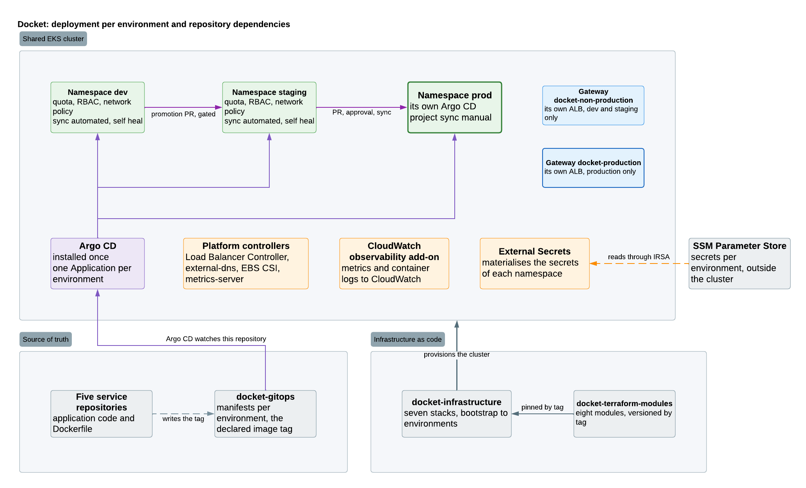

# Deployment per environment

**Purpose** Define what separates one environment from another, how a change advances to production, and which controls exist at each transition.

The components are described in [`logical-architecture.md`](logical-architecture.md). The physical layer holding this cluster up is in [`aws-infrastructure.md`](aws-infrastructure.md).

## Topology

A single Amazon EKS cluster in `us-east-1`, with three namespaces: `dev`, `staging` and `prod`. Each namespace runs a complete instance of the application, that is the five services plus Redis.

Alongside the application, running inside the cluster:

| Component | Role |
|---|---|
| **Argo CD** | Synchronises the three namespaces against the manifest repository |
| **External Secrets Operator** | Materialises the parameters it reads from SSM Parameter Store as Kubernetes `Secret` objects, per namespace |
| **AWS Load Balancer Controller** | Translates `Ingress` objects into ALB configuration |
| **Observability stack** | Prometheus, Grafana, Zipkin and centralised logs |

## Boundaries between development, staging and production

**What separates them.** Isolation is logical. Each namespace has its own RBAC, its own resource quotas and its own secret prefix in Parameter Store (`/docket/<environment>/...`), reachable only by its IRSA role. Sharing a cluster means there is no node or control plane isolation, so an incident in the cluster reaches all three environments at once, production included.

**What they share.** The cluster, the nodes, the registry, the ALB, the Argo CD instance and the DNS zone. What changes between environments is the image version declared in the manifests, and the origin of that image is always the same registry.

**What connects them.** Only promotion, and always in one direction: `dev` to `staging` to `prod`. There is no traffic between namespaces and no access from one environment to another's data.

**The controls.**

Each environment has two independent controls: one over the merge in the manifest repository, and one over the synchronisation Argo CD performs.

| Target environment | Control over the merge | Argo CD sync policy |
|---|---|---|
| `dev` | None additional | `automated`, syncs when the change is detected |
| `staging` | Pull request with review | `automated`, syncs after the merge |
| `prod` | Pull request with review and approval from a designated owner | **Manual**, someone triggers the sync after the merge |

The distinction between the two controls matters in production. Approving and merging the pull request leaves the version declared in Git, and the change reaches the cluster only when a person runs the sync of the Argo CD `Application`. They are two separate, auditable acts.

Designing the approval policies and naming the owners belongs to area 04. What is defined here is the boundary those policies must respect.

## GitOps flow

The manifest repository holds the declarative truth of the three environments. Argo CD runs inside the cluster, watches that repository and synchronises each namespace with what is declared.

The important consequence: the pipeline never applies changes to the cluster directly. GitHub Actions builds the image and publishes it to ECR, and the deployment happens when a manifest in Git references that new version. Every change in production has, by construction, a commit explaining it.

This flow imposes one constraint on tagging: **image tags must be immutable**. With a tag that gets rewritten, the manifest does not change, Argo CD detects nothing, and promotion between environments stops working. The concrete tagging scheme is defined when the pipeline is built.

The same applies to infrastructure: the Terraform pipeline provisions the AWS layer and leaves the inside of the cluster untouched. They are two independent flows. See [`aws-infrastructure.md`](aws-infrastructure.md#infrastructure-change-flow).

> **Consequence of the ephemeral lifecycle.** The cluster is destroyed and recreated routinely ([ADR-010](decisions.md#adr-010-ephemeral-infrastructure-with-split-state)). Anything living inside it and not declared in the GitOps repository is lost on every cycle: Prometheus and Redis data are ephemeral by construction, and Argo CD must be installed from the Terraform stack or from a declared bootstrap so the cluster rebuilds without manual intervention.

## Dependencies between repositories and environments

| Repository role | What it contributes | How it reaches the environment |
|---|---|---|
| **Service repositories**, one per microservice | Application code | A push triggers the pipeline, which builds the image and publishes it to ECR with an immutable tag |
| **Infrastructure repository** | Terraform, split into a persistent stack and an ephemeral stack | Provisions the VPC, the cluster and the supporting resources |
| **GitOps manifest repository** | Declarative state per environment | Argo CD watches it and synchronises each namespace |
| **External configuration repository** | Per-environment application configuration (External Configuration Store) | Consumed at deployment time, separate from the image |
| **Documentation repository** (this one) | Reference architecture and decisions | Not deployed. It is the source for the other four |

## Secrets management

The application secrets, among them the `JWT_SECRET` shared by Auth API, Users API and Todos API, live in SSM Parameter Store as `SecureString`, outside the cluster. External Secrets Operator reads them through IRSA and materialises them as Kubernetes `Secret` objects in each namespace.

The scope is per environment: the `dev` IRSA role has read access only to `/docket/dev/...`. No secret is left in plain text in a repository, and the set survives the destruction of the cluster.

The AWS credentials the pipeline uses are resolved through OIDC federation with temporary credentials, separately from this mechanism. See [ADR-011](decisions.md#adr-011-pipeline-credentials-with-oidc-and-an-iam-role).

## Domain, DNS and TLS

Each environment resolves through a different host towards the same ALB, and the Ingress separates traffic by `Host` header.

| Environment | Host |
|---|---|
| `prod` | `docket.<domain>` |
| `staging` | `staging.docket.<domain>` |
| `dev` | `dev.docket.<domain>` |

The certificate is issued by ACM and terminates at the ALB. The Route 53 records are ALIAS type. They are created by external-dns from inside the cluster rather than by Terraform, because the ALB is recreated on every cluster cycle and changes DNS name. Detail in [`aws-infrastructure.md`](aws-infrastructure.md#domain-dns-and-tls).
