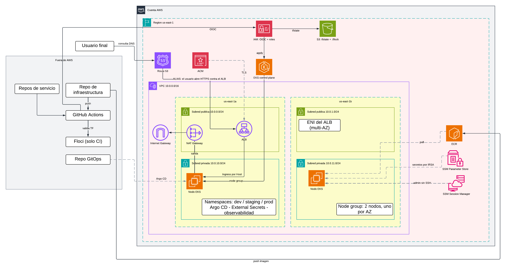

# Infraestructura física en AWS

| | |
|---|---|
| **Propósito** | Definir la capa física sobre la que corre Docket: cuenta, red, cómputo, registry, backend de estado, identidad y secretos. |
| **Región** | `us-east-1` |



Esta vista responde a sobre qué corre el clúster descrito en [`ambientes.md`](ambientes.md). Los componentes de la aplicación están en [`logica.md`](logica.md); las decisiones que sostienen este diseño, en [`decisiones.md`](decisiones.md).

## Presupuesto

La cuenta opera bajo el plan gratuito de AWS por créditos. El acceso a los servicios termina cuando se agota el saldo o cuando vence el plazo del plan, sin que se generen cargos. El presupuesto es por tanto la restricción de diseño principal.

| Concepto | Valor |
|---|---|
| Saldo disponible | 100 USD |
| Saldo adicional alcanzable | 100 USD por completar 5 actividades guiadas de 20 USD cada una |
| Ventana de trabajo del proyecto | 2 semanas |

Costo estimado de esta arquitectura encendida de forma continua durante 2 semanas (336 h) en `us-east-1`:

| Recurso | Cálculo | USD |
|---|---|---|
| Control plane de EKS | 0.10 USD/h | 33.60 |
| 2 nodos `t3.medium` | 0.0416 USD/h cada uno | 27.95 |
| NAT Gateway | 0.045 USD/h más tráfico procesado | 15.12 |
| Application Load Balancer | 0.0225 USD/h más LCU | ~7.60 |
| IPv4 públicas (2 del ALB, 1 del NAT) | 0.005 USD/h cada una | 5.04 |
| EBS de los nodos (2 volúmenes gp3 de 20 GB) | 0.08 USD/GB-mes | ~1.50 |
| S3, ECR, Route 53, Parameter Store | | ~1.50 |
| **Total, 2 semanas 24/7** | | **~92** |

Con nodos `t3.small` el total baja a ~78 USD, a costa de capacidad. Ver [Cómputo](#cómputo).

**Implicación operativa.** Con 100 USD el margen es de apenas 8 USD sobre el costo estimado. Completar las 5 actividades para llegar a 200 USD es un prerrequisito práctico antes de aplicar esta arquitectura. La instancia de RDS o Aurora que pide una de las actividades debe eliminarse en cuanto se complete, porque es el único recurso de ese conjunto capaz de consumir créditos de forma sostenida si queda encendido.

**Palanca de ahorro.** El diseño está pensado para destruirse y recrearse ([ADR-010](decisiones.md#adr-010-infraestructura-efímera-con-estado-dividido)). Apagar fuera del horario de trabajo reduce el costo a menos de la mitad, y cubre la meta extra de FinOps del brief.

## Red

EKS exige subredes en al menos dos zonas de disponibilidad, así que la VPC se despliega sobre `us-east-1a` y `us-east-1b`.

| Subred | CIDR | AZ | Contenido | Tabla de ruta |
|---|---|---|---|---|
| Pública A | `10.0.0.0/24` | `us-east-1a` | ALB, NAT Gateway | `0.0.0.0/0` hacia el Internet Gateway |
| Pública B | `10.0.1.0/24` | `us-east-1b` | ENI del ALB | `0.0.0.0/0` hacia el Internet Gateway |
| Privada A | `10.0.10.0/24` | `us-east-1a` | Nodo del clúster | `0.0.0.0/0` hacia el NAT Gateway |
| Privada B | `10.0.11.0/24` | `us-east-1b` | Nodo del clúster | `0.0.0.0/0` hacia el NAT Gateway |

Los nodos viven en subredes privadas, sin IP pública y sin ser alcanzables desde internet. Su tráfico de salida, que incluye el pull de imágenes y las llamadas a la API de AWS, pasa por el NAT Gateway. El único componente expuesto es el ALB.

Se despliega **un solo NAT Gateway**, en la subred pública A, compartido por ambas zonas. La topología de referencia usa uno por zona, y duplicar el componente añadiría 15 USD sobre la ventana del proyecto. La consecuencia de esta concesión: si `us-east-1a` deja de estar disponible, los nodos de `us-east-1b` pierden su salida a internet. Ver [ADR-005](decisiones.md#adr-005-red-multi-az-con-un-solo-nat-gateway).

### Security groups

| Security group | Entrada | Salida |
|---|---|---|
| `sg-alb` | `80/tcp` y `443/tcp` desde `0.0.0.0/0` | Hacia `sg-nodos`, en el puerto del contenedor del Frontend |
| `sg-nodos` | Desde `sg-alb` en el puerto del contenedor, y desde sí mismo para el tráfico entre nodos | Todo |

Ninguna regla abre `22/tcp` en ninguna parte. El acceso administrativo se resuelve por SSM. Ver [Acceso administrativo](#acceso-administrativo).

**Modo de registro de targets.** El AWS Load Balancer Controller registra los targets del ALB en modo `ip`, que es su comportamiento por defecto sobre EKS y aprovecha que el CNI de AWS asigna a cada pod una dirección real de la VPC. El ALB entrega el tráfico directamente al pod, sin pasar por un NodePort ni por kube-proxy.

De ahí viene la regla de `sg-nodos`: el puerto que hay que abrir es el del contenedor, y el rango de NodePort queda sin uso. Si en algún momento se cambia a modo `instance` con la anotación `alb.ingress.kubernetes.io/target-type`, esta regla tiene que revisarse.

## Cómputo

Amazon EKS con un node group gestionado de 2 nodos, uno por zona de disponibilidad, en las subredes privadas.

**Dimensionamiento.** El clúster sostiene tres namespaces con la aplicación completa, es decir 5 servicios más Redis en cada uno, lo que suma 18 pods de aplicación. A eso se añaden Argo CD, External Secrets Operator, AWS Load Balancer Controller y el stack de observabilidad. La restricción que decide el tamaño de instancia es el límite de pods por nodo que impone el CNI de EKS según las ENI disponibles:

| Tipo | RAM | Pods máximos por nodo | 2 nodos |
|---|---|---|---|
| `t3.small` | 2 GiB | 11 | 22 |
| `t3.medium` | 4 GiB | 17 | 34 |

Con 18 pods de aplicación más los add-ons del clúster, dos `t3.small` quedan por debajo del requerimiento. El diseño usa **`t3.medium`**, con un costo adicional de ~14 USD sobre la ventana del proyecto.

## Registry: Amazon ECR

Cinco repositorios privados, uno por microservicio. Los nodos hacen `pull` con el rol de instancia del node group, sin credenciales estáticas ni `imagePullSecrets` que rotar.

La capa gratuita de ECR cubre 500 MB al mes, que es poco para cinco servicios acumulando tags. Hace falta una política de ciclo de vida que conserve solo las últimas N imágenes por repositorio. Definirla corresponde a la historia de Terraform.

## Backend de estado de Terraform

```hcl
terraform {
  backend "s3" {
    bucket       = "docket-tfstate-<sufijo>"
    key          = "<stack>/terraform.tfstate"
    region       = "us-east-1"
    encrypt      = true
    use_lockfile = true   # bloqueo nativo de S3
  }
}
```

El bloqueo usa un objeto `.tflock` en el mismo bucket, mediante escrituras condicionales de S3. El argumento `dynamodb_table` está deprecado en el backend S3 desde Terraform 1.11 y HashiCorp lo removerá en una versión menor futura, así que el diseño no crea tabla de DynamoDB. Ver [ADR-009](decisiones.md#adr-009-bloqueo-de-estado-nativo-de-s3).

Permisos mínimos que exige el backend:

| Acción | Recurso |
|---|---|
| `s3:ListBucket` | `arn:aws:s3:::<bucket>` |
| `s3:GetObject`, `s3:PutObject`, `s3:DeleteObject` | `arn:aws:s3:::<bucket>/<key>` |
| `s3:GetObject`, `s3:PutObject`, `s3:DeleteObject` | `arn:aws:s3:::<bucket>/<key>.tflock` |

El bucket lleva versionado activo, cifrado en reposo y bloqueo de acceso público.

### Separación de estado persistente y efímero

La infraestructura se destruye y se recrea de forma rutinaria, así que el Terraform se divide en dos stacks con estados independientes:

| Stack | Contiene | Ciclo de vida |
|---|---|---|
| `persistente` | Bucket de estado, ECR, zona de Route 53, certificado de ACM, OIDC provider, IAM roles y parámetros de SSM | Se crea una vez y permanece |
| `efimero` | VPC, subredes, NAT, EKS, node group, ALB | `apply` y `destroy` a demanda |

Sin esta separación, un `destroy` arrastraría el registry, los secretos y la zona DNS. Ver [ADR-010](decisiones.md#adr-010-infraestructura-efímera-con-estado-dividido).

## Identidad y acceso

| Principal | Cómo obtiene credenciales | Para qué |
|---|---|---|
| **GitHub Actions, job de build** | Federación OIDC; asume `GitHubActionsBuildRole` | Publicar imágenes en ECR |
| **GitHub Actions, job de infraestructura** | Federación OIDC; asume `GitHubActionsDeployRole` | Ejecutar `terraform apply` |
| **Nodos del clúster** | Rol de instancia del node group | `pull` desde ECR |
| **External Secrets Operator** | IRSA, con un rol de IAM asociado a su service account | Leer parámetros de SSM |
| **AWS Load Balancer Controller** | IRSA | Crear y configurar el ALB |
| **Personas del equipo** | Usuario IAM entregado por el team lead | Consola y `kubectl` mediante EKS access entries |

**Dos roles, no uno.** El job que construye imágenes no necesita permisos para crear VPCs ni clústeres, así que se separa en un rol propio limitado a `ecr:*` sobre los cinco repositorios. El rol amplio, con permisos sobre EC2, VPC, IAM, S3, EKS y Route 53, queda reservado al job que ejecuta Terraform. Esta separación responde al criterio de accesos limitados según necesidad de la historia `18` del tablero.

La política de confianza de cada rol se restringe al repositorio y la rama concretos, con una condición sobre `sub` del tipo `repo:<org>/<repo>:ref:refs/heads/<rama>`. Un rol asumible por cualquier repositorio de la organización equivale a una credencial compartida. Ver [ADR-011](decisiones.md#adr-011-credenciales-de-pipeline-con-oidc-e-iam-role).

### Acceso administrativo

El acceso puntual a un nodo se hace con **SSM Session Manager**: la sesión se inicia contra la API de AWS, se autoriza por IAM y queda registrada en CloudTrail, sin abrir ningún puerto de entrada. La administración del clúster se hace con `kubectl` contra el endpoint de EKS, autorizado también por IAM. Ver [ADR-006](decisiones.md#adr-006-acceso-administrativo-con-ssm-session-manager).

## Secretos

Los secretos de la aplicación, entre ellos el `JWT_SECRET` compartido, viven en **SSM Parameter Store** como `SecureString`, fuera del clúster. Dentro del clúster, **External Secrets Operator** los lee mediante IRSA y los materializa como `Secret` de Kubernetes en cada namespace.

El motivo de fondo es el ciclo de vida efímero del clúster. Un mecanismo que guarde la llave de descifrado dentro del clúster, como Sealed Secrets, pierde esa llave en cada `destroy` y deja inservibles los secretos cifrados del repositorio. Ver [ADR-002](decisiones.md#adr-002-secretos-con-external-secrets-y-ssm-parameter-store).

El árbol de parámetros se segmenta por ambiente (`/docket/dev/...`, `/docket/staging/...`, `/docket/prod/...`) y el rol de IRSA de cada namespace tiene permiso de lectura solo sobre su propio prefijo.

## Flujo de cambio de infraestructura

1. Un push al repo de infraestructura dispara GitHub Actions.
2. El job de validación corre `terraform plan` y `apply` contra **Floci** en el runner, con un provider `aws` aliasado a `localhost:4566`. Ahí se detectan errores de sintaxis, referencias rotas y políticas mal formadas, sin tocar la cuenta real.
3. Superada la validación, el job de infraestructura solicita el token OIDC, asume `GitHubActionsDeployRole` y corre `terraform apply` contra la cuenta real.

Este flujo corre en paralelo al despliegue de la aplicación. Argo CD sincroniza el repositorio de manifiestos por su cuenta y la pipeline de Terraform nunca aplica cambios dentro del clúster. Ver [`ambientes.md`](ambientes.md#flujo-gitops).

Floci emula la API de AWS sin plano de datos: un EKS creado contra Floci responde como recurso pero no ejecuta pods. Su alcance es validar el código de infraestructura antes de aplicarlo. Ver [ADR-007](decisiones.md#adr-007-validación-de-terraform-contra-floci-en-ci).

## Dominio, DNS y TLS

Route 53 aloja la zona del dominio comprado por el equipo. Cada ambiente resuelve por un host distinto hacia el mismo ALB, mediante registros **ALIAS**, y el Ingress separa el tráfico por cabecera `Host`.

| Ambiente | Host |
|---|---|
| `prod` | `docket.<dominio>` |
| `staging` | `staging.docket.<dominio>` |
| `dev` | `dev.docket.<dominio>` |

El certificado TLS lo emite **AWS Certificate Manager**, con validación por DNS contra la misma zona de Route 53, y termina en el ALB. ACM entrega certificados públicos sin costo y los renueva de forma automática mientras exista el registro de validación en la zona. Ver [ADR-008](decisiones.md#adr-008-dns-en-route-53-y-tls-con-acm).

**Alcance del cifrado.** El tráfico viaja cifrado entre el usuario y el ALB. Del ALB hacia el pod circula como HTTP plano dentro de la VPC. Si el área 08 exige cifrado de extremo a extremo, hay que habilitar re-encriptación hacia el target group, algo que este diseño todavía no contempla.

El ALB se recrea con cada `apply` y cambia de nombre DNS. Por eso los registros se gestionan desde Terraform o con `external-dns`.

Queda un paso manual, que se ejecuta una sola vez: delegar los nameservers del dominio en el registrador hacia los cuatro que Route 53 asigne a la zona.

## Procedimiento de apagado y encendido

El ciclo de `destroy` y `apply` tiene un orden obligatorio, porque no todos los recursos los crea Terraform.

**El problema.** El ALB no lo crea Terraform. Lo crea el AWS Load Balancer Controller desde dentro del clúster, a partir de los objetos `Ingress`, así que no figura en el estado de Terraform. Un `terraform destroy` con los `Ingress` todavía presentes elimina el clúster junto con el controller, que muere sin alcanzar a borrar el balanceador. El resultado son un ALB huérfano facturando por hora, sus security groups asociados y, con frecuencia, un `destroy` que falla al no poder eliminar la VPC porque esos security groups siguen en uso.

**Orden de apagado.**

1. Eliminar las `Application` de Argo CD o los objetos `Ingress` de los tres namespaces.
2. Esperar a que el controller elimine el ALB y sus security groups. Verificarlo en la consola de EC2, sección Load Balancers, antes de continuar.
3. Ejecutar `terraform destroy` sobre el stack `efimero`.
4. Dejar intacto el stack `persistente`.

**Orden de encendido.**

1. Ejecutar `terraform apply` sobre el stack `efimero`.
2. Instalar los add-ons del clúster, entre ellos Argo CD, el AWS Load Balancer Controller y External Secrets Operator, desde el bootstrap declarado.
3. Argo CD sincroniza los manifiestos y crea los `Ingress`.
4. El controller crea el ALB, con un nombre DNS nuevo.
5. Actualizar los registros ALIAS de Route 53 para que apunten al ALB nuevo. Terraform o `external-dns` se encargan de este paso.

**Verificación de que no quedó nada facturando.** Después de cada apagado conviene revisar que no queden balanceadores, IP elásticas sin asociar ni volúmenes EBS huérfanos, porque son los tres recursos que sobreviven con más facilidad a un `destroy` incompleto y consumen créditos en silencio.
