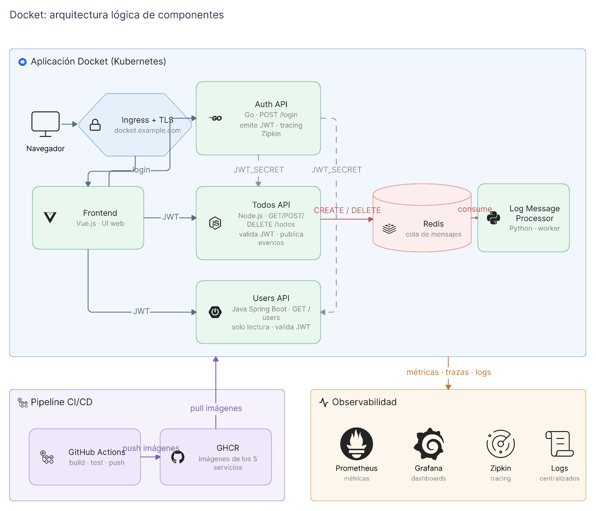

# Arquitectura lógica de componentes

Vista de qué piezas componen Docket y cómo se hablan entre ellas, sin entrar en dónde corre cada una. Eso está en [`ambientes.md`](ambientes.md).

## Componentes de aplicación

Cinco microservicios y una cola de mensajes. Cada servicio se despliega por separado y puede escalarse de forma independiente.

| Componente | Stack | Rol | Configuración |
|---|---|---|---|
| **Frontend** | Vue.js | Interfaz web. Es el único componente expuesto públicamente, a través del Ingress con TLS. | `PORT`, `AUTH_API_ADDRESS`, `TODOS_API_ADDRESS` |
| **Auth API** | Go | Autenticación. `POST /login` valida credenciales y emite un token JWT. | `AUTH_API_PORT`, `USERS_API_ADDRESS`, `JWT_SECRET` |
| **Users API** | Java, Spring Boot | Perfiles de usuario, solo lectura: `GET /users` y `GET /users/:username`. | `SERVER_PORT`, `JWT_SECRET` |
| **Todos API** | Node.js | CRUD de tareas: `GET`, `POST` y `DELETE /todos`. Publica un evento por cada alta y baja. | `TODO_API_PORT`, `JWT_SECRET`, `REDIS_HOST`, `REDIS_PORT`, `REDIS_CHANNEL` |
| **Log Message Processor** | Python | Worker que consume la cola y procesa los eventos de forma asíncrona. | `REDIS_HOST`, `REDIS_PORT`, `REDIS_CHANNEL` |
| **Redis** | | Cola de mensajes entre Todos API (productor) y Log Message Processor (consumidor). | |

## Flujos

**Autenticación.** El navegador entra por el Ingress y llega al Frontend. El Frontend pide login a Auth API, que valida las credenciales y devuelve un JWT.

**Operación sobre tareas.** El Frontend usa ese JWT para llamar a Todos API y a Users API. Ambos validan el token con el mismo secreto con el que Auth API lo firmó.

**Registro asíncrono.** Cada alta y baja en Todos API publica un mensaje en Redis. Log Message Processor lo consume por su cuenta, de modo que el registro de la operación no bloquea la respuesta al usuario.

### El secreto compartido

Auth API firma los tokens y Users API y Todos API los verifican, así que los tres necesitan el mismo valor de `JWT_SECRET`. Es el acoplamiento más fuerte del sistema: rotar ese secreto obliga a actualizar los tres servicios de forma coordinada. Nunca va en el código ni en texto plano en un repositorio; su gestión está descrita en
[`ambientes.md`](ambientes.md#gestión-de-secretos).

## Plataforma de soporte

**Registry: GitHub Container Registry.** Guarda las imágenes de los cinco servicios. Es único y compartido por los tres ambientes: lo que cambia entre ambientes es qué versión de la imagen se despliega, no de dónde sale.

**Integración continua: GitHub Actions.** Construye, prueba y publica las imágenes al registry. El diseño de las pipelines corresponde al área 04 y no se detalla aquí.

**Observabilidad: Prometheus, Grafana, Zipkin y logs centralizados.** Métricas, dashboards por servicio, tracing distribuido y logs. El detalle del despliegue de este stack corresponde al área 07.

Conviene saber que la observabilidad no arranca de cero dado que `auth-api` ya incluye instrumentación de tracing con Zipkin en `tracing.go`. Es el punto de partida sobre el que extender el resto de los servicios.

## Estado actual frente a esta arquitectura

Este documento describe la arquitectura **objetivo**. La aplicación base todavía no está contenerizada: no hay Dockerfiles ni manifiestos de Kubernetes. Los componentes de la plataforma de soporte (registry, pipelines, observabilidad) están decididos pero aún no desplegados. Ver
[`decisiones.md`](decisiones.md) para los supuestos que sostienen este diseño.
