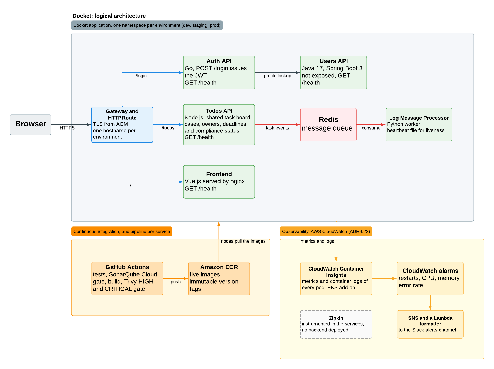

# Logical component architecture

| | |
|---|---|
| **Purpose** | Describe which pieces make up Docket and how they talk to each other, without going into where each one runs. |
| **Audience** | The whole team. It is the entry point for understanding the system without reading the code. |
| **Status** | The components and their dependencies are verified against the `microservice-app-example` code. The supporting platform (registry, pipelines, CloudWatch observability) is deployed as described. |

Where each thing runs is in [`environments.md`](environments.md) and [`aws-infrastructure.md`](aws-infrastructure.md).

## Application components

Five microservices and a message queue. Each service is deployed separately and scales independently.

| Component | Stack | Role | Environment variables |
|---|---|---|---|
| **Frontend** | Vue.js, served by nginx | Web interface. nginx serves the built single-page application and answers `GET /health`; it holds no proxy, so the browser reaches the APIs through the `HTTPRoute`, not through it. | `PORT`, `AUTH_API_ADDRESS`, `TODOS_API_ADDRESS`, `ZIPKIN_URL` |
| **Auth API** | Go | Authentication. `POST /login` validates credentials against Users API and issues a JWT. | `AUTH_API_PORT`, `USERS_API_ADDRESS`, `JWT_SECRET`, `ZIPKIN_URL` |
| **Users API** | Java, Spring Boot | User profiles, read only: `GET /users` and `GET /users/:username`. | `SERVER_PORT`, `JWT_SECRET` |
| **Todos API** | Node.js | Task CRUD: `GET`, `POST` and `DELETE /todos`. Publishes an event on every create and delete. | `TODO_API_PORT`, `JWT_SECRET`, `REDIS_HOST`, `REDIS_PORT`, `REDIS_CHANNEL`, `ZIPKIN_URL` |
| **Log Message Processor** | Python | Worker consuming the queue and processing the events asynchronously. | `REDIS_HOST`, `REDIS_PORT`, `REDIS_CHANNEL`, `ZIPKIN_URL` |
| **Redis** | — | Message queue between Todos API (producer) and Log Message Processor (consumer). | — |

## Flows

### Authentication

The browser posts to `/login`, and the `HTTPRoute` sends that prefix to Auth API. To validate the credentials, Auth API requests the profile from Users API (`GET /users/:username`) and compares it against its list of allowed credentials. On a match it issues the JWT the rest of the session will use.

> To call Users API, Auth API signs its own service token with the same `JWT_SECRET` and sends it as a `Bearer`. The shared secret therefore serves two purposes: it validates user tokens and it authenticates the call between services.

### Task operations

The browser sends the user JWT to `/todos`, and the `HTTPRoute` sends that prefix to Todos API. Todos API validates the token with the same secret Auth API signed it with.

**Users API is not exposed.** The `HTTPRoute` declares three matches, `/login` to Auth API, `/todos` to Todos API and `/` to the Frontend. Users API appears in none of them, so its only client is the traffic that reaches it inside the namespace, from Auth API.

### Asynchronous logging

Every create and delete in Todos API publishes a message on the Redis channel. Log Message Processor consumes it on its own, so recording the operation does not block the response to the user.

### The shared secret

Auth API signs the tokens; Users API and Todos API verify them. All three need the same `JWT_SECRET` value.

It is the strongest coupling in the system. Rotating it requires updating the three services in a coordinated way, and during the rotation tokens issued with the previous value stop validating. Its management is described in [`environments.md`](environments.md#secrets-management), and it never travels in code or in plain text inside a repository.

## Supporting platform

**Registry: Amazon ECR.** Holds the images of the five services and is shared by the three environments. What changes between environments is the image version deployed, with the same origin in every case. See [ADR-001](decisions.md#adr-001-registry-amazon-ecr).

**Continuous integration: GitHub Actions.** Builds, tests and publishes the images to the registry. Pipeline design belongs to area 04 and is not detailed here.

**Observability: CloudWatch Container Insights and Argo CD.** Kubernetes/EKS metrics and centralised container logs through the CloudWatch Observability EKS add-on, plus Argo CD for deployment state; health is covered by each service's own probes. See [ADR-023](decisions.md#adr-023-observability-cloudwatch-container-insights) for why a self-hosted Prometheus, Grafana and Loki stack is deferred rather than built. Deploying this belongs to area 07.

Observability starts from an existing base. `auth-api` already includes Zipkin tracing instrumentation in `tracing.go`, every service reads `ZIPKIN_URL`, and the Frontend already sends spans from the browser through its own `/zipkin` proxy. Area 07 keeps that instrumentation in place; deploying a tracing backend is deferred ([ADR-023](decisions.md#adr-023-observability-cloudwatch-container-insights)).
