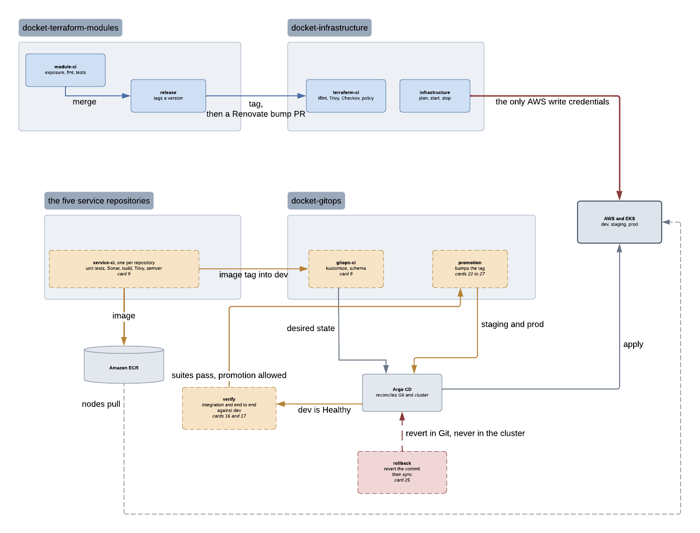
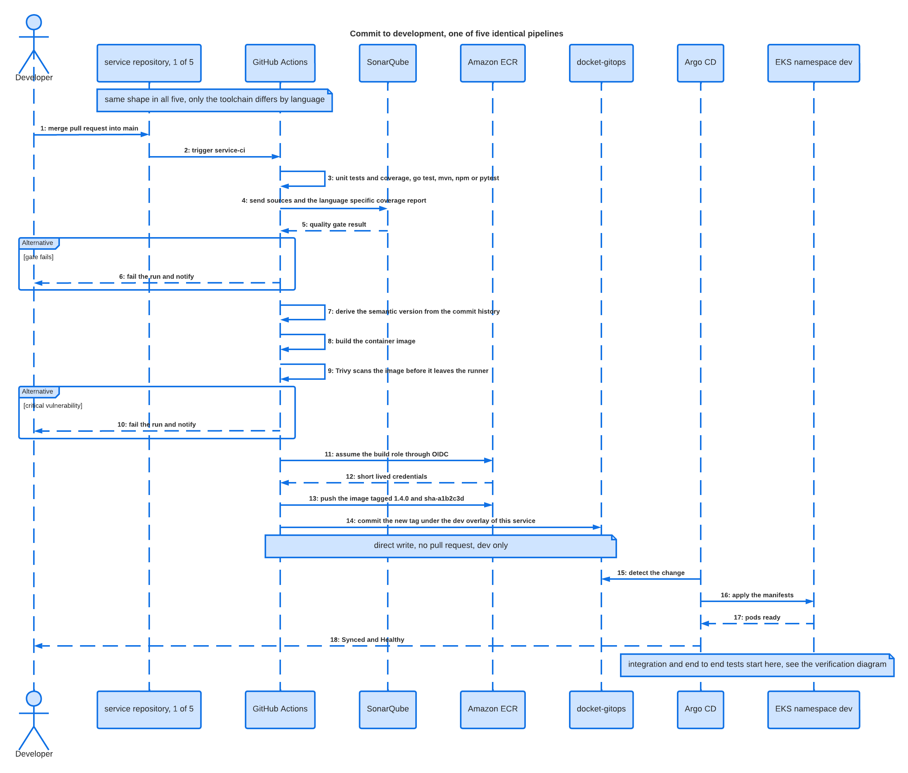
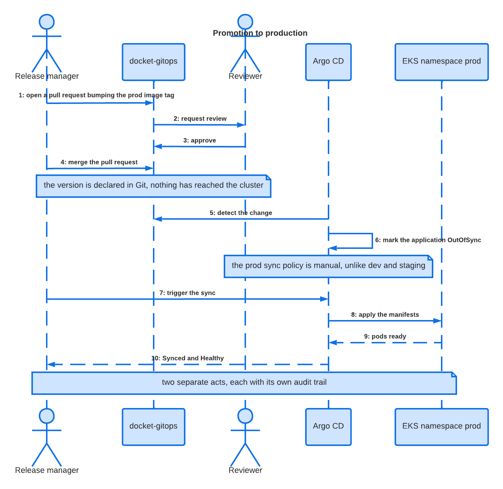
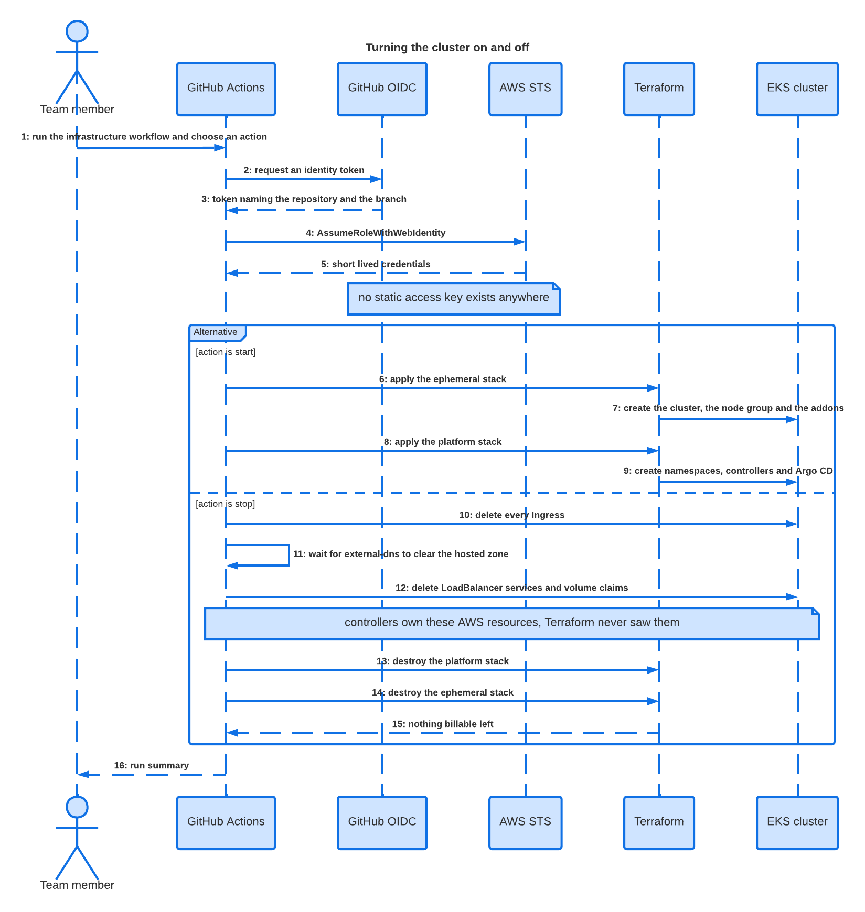
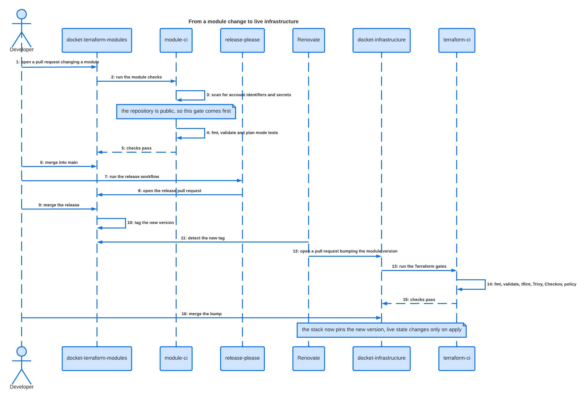
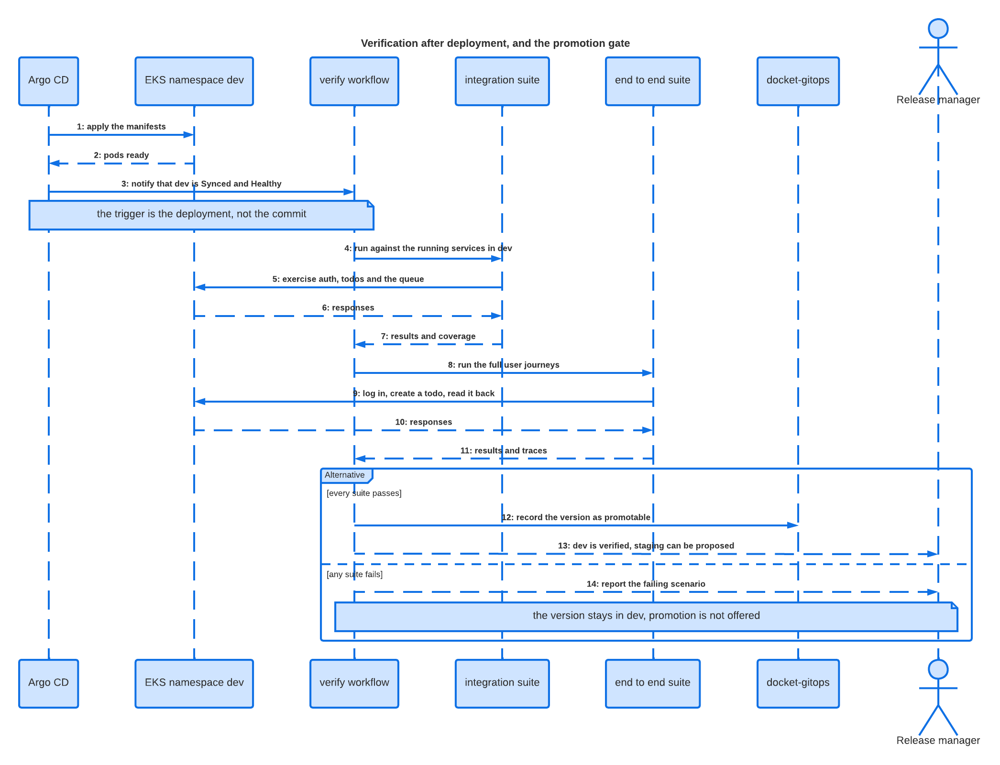
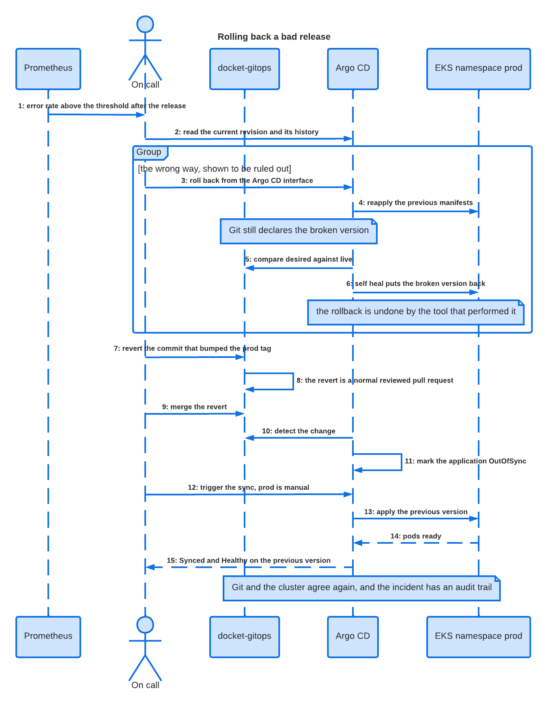

# Pipelines

How work reaches the cluster, which automation owns each step, and where a change is
stopped when it should not go further.

The project runs ten pipelines across four repositories. Five work today. Five belong to
card 9 and later. This document maps all of them and sequences the six where the order of
messages between independent actors carries information.

## Why the work is split across pipelines

A single long pipeline that builds, tests, deploys and verifies is the wrong shape here,
for three reasons.

**End to end tests need a deployed system.** They cannot run in the job that produced the
image, because at that moment nothing is running. They run against `dev` after Argo CD has
applied the manifests, which is a different trigger and a different pipeline.

**Feedback time compounds.** A unit test failure should be known in two minutes. If unit
tests share a pipeline with an end to end suite that needs a deployment, every failure
costs the full run.

**The deliverables document requires the separation.** It asks that CI build and publish
artifacts and that Argo CD perform the deployment. A pipeline that did both would collapse
that boundary.

The project therefore needs one more pipeline, `verify`, which runs after deployment and
produces the signal that authorises promotion.

## Which pipelines get a sequence diagram

A sequence diagram earns its place when **several independent actors exchange messages and
the order matters**. When a pipeline is a list of steps inside one runner, its sequence
diagram becomes a column of arrows from a participant to itself, and a table says the same
in less space.

| Pipeline | Repository | Actors | Treatment |
|---|---|---|---|
| `service-ci` | the five service repositories | 8 | Sequence 1 |
| promotion | `docket-gitops` | 5 | Sequence 2 |
| `infrastructure` | `docket-infrastructure` | 6 | Sequence 3 |
| `release` and Renovate | `docket-terraform-modules` | 6, crosses repositories | Sequence 4 |
| `verify` | `docket-gitops` | 7 | Sequence 5 |
| rollback | `docket-gitops` | 5 | Sequence 6 |
| `pr-conventions` | all nine | 2 | Gate table |
| `terraform-ci` | `docket-infrastructure` | 2 | Gate table |
| `module-ci` | `docket-terraform-modules` | 2 | Gate table |
| `gitops-ci` | `docket-gitops` | 2 | Gate table |

## How the pipelines connect

Four properties of the system are visible in the map.

**Only `infrastructure` holds write credentials for AWS.** Every other gate is static
analysis and needs no cloud identity. The one workflow that can destroy the cluster is
therefore manual and sits behind a single OIDC role.

**A version joins the two Terraform repositories.** `docket-terraform-modules` cuts a tag,
Renovate opens a bump pull request, and live state changes on apply. Each step is an
explicit decision, so a module change reaches production only when someone chooses it.

**`docket-gitops` sits between code and cluster.** No pipeline holds `kubectl`
credentials. Every deployment happens because Argo CD read a commit.

**Verification gates promotion.** `verify` turns a deployed version into a promotable one,
and its result is the evidence a promotion rests on.

## The test pyramid, and where each level runs

The three levels the deliverables document requires belong in different places.

| Level | Runs in | Against | Trigger | Card |
|---|---|---|---|---|
| Unit | `service-ci` | the code, nothing deployed | every push and pull request | 10 |
| Integration | `verify` | the services running in `dev` | Argo CD reports `dev` Healthy | 16 |
| End to end | `verify` | the full journey through `dev` | same run, after integration | 17 |

The split follows from what each level needs. Unit tests need a compiler. Integration
tests need several services talking to each other and to Redis. End to end tests need the
frontend, the APIs and the queue all reachable through the ingress.

Coverage is produced at the unit level and consumed by SonarQube. Integration and end to
end produce pass or fail plus traces, and their result is what the promotion gate reads.

**Current state.** Of the five services, only `users-api` contains a test file, and it is
the empty Spring context test inherited from the upstream fork. The other four have none.
Cards 10, 16 and 17 start from zero.

## Sequence 1. Commit to development

**One diagram covers all five services.** The pipeline has the same shape in every
repository, so five identical lifelines would widen the diagram without adding
information. The toolchain differs, and only in the first two steps.

| Service | Language | Unit tests | Coverage format for Sonar |
|---|---|---|---|
| `docket-auth-api` | Go | `go test` | `cover.out` |
| `docket-users-api` | Java, Maven | `mvn test` | JaCoCo XML |
| `docket-todos-api` | Node.js | `npm test` | LCOV |
| `docket-frontend` | Vue | `npm test` | LCOV |
| `docket-log-message-processor` | Python | `pytest` | `coverage.xml` |

Everything from the build onwards is identical, which is the half worth extracting into a
shared action once all five work.

The diagram fixes five decisions.

**Trivy scans the image while it is still on the runner.** A critical finding stops the
run before the image reaches ECR. The registry's own scan happens after publication, when
the vulnerable image is already available to deploy.

**The image carries two tags.** A semantic version and the commit sha. The deliverables
document asks to tie every build to a commit and to an identifiable version, which are two
different questions. The version identifies a release in conversation, the sha identifies
the exact source.

**Development is written directly, with no pull request.** The environment document
assigns the controls: none extra for `dev`, review for `staging`, review plus approval for
`prod`. A pull request in `dev` would mean every merge to `main` opens another pull request
for someone to merge.

**The pipeline writes into `docket-gitops`.** The alternative is a process that watches ECR
for new images, which adds delay, fails quietly, and loses the link between a commit and
the deployment it produced.

**Argo CD appears at the end.** No arrow runs from GitHub Actions to the cluster.

## Sequence 2. Promotion to production

Production has **two independent controls**, each an act of its own with its own audit
trail.

Approving and merging declares the version in Git, and the cluster is untouched at that
moment. The change lands when a person triggers the sync, because the production
Application uses a manual sync policy while `dev` and `staging` are automated.

## Sequence 3. Turning the cluster on and off

The only pipeline with write credentials on AWS. The diagram documents behaviour already
in production.

The shutdown branch is where the ordering matters. The workflow talks to the Kubernetes
API **before** Terraform destroys anything, because load balancers, DNS records and volumes
are created by controllers inside the cluster and never entered Terraform state.
Destroying the cluster first leaves all three orphaned and billing.

## Sequence 4. From a module change to live infrastructure

The only flow that crosses repositories, introduced by ADR-012 when modules moved out of
`docket-infrastructure`.

It also shows why the exposure scan runs first in `module-ci`. The module repository is
public and so is its Git history, so clearing an account identifier committed by mistake
requires rewriting history.

## Sequence 5. Verification after deployment

The upper two levels of the test pyramid, and the pipeline that puts evidence behind a
promotion.

The deployment triggers it. Argo CD reports `dev` as Synced and Healthy, and the
integration and end to end suites then run against the services that are actually running.

The outcome is a gate. Suites pass and the version is recorded as promotable, so the
promotion pipeline has something to act on. Suites fail and the version stays in `dev` with
a named failing scenario. This is what the deliverables document means by minimum approval
criteria for promotion between environments.

## Sequence 6. Rolling back a bad release

The deliverables document asks for documented rollback plans. In GitOps the procedure has
a counterintuitive property, and the diagram shows both paths so the working one is
unambiguous.

**Rolling back from the Argo CD interface fails here.** Argo CD reapplies the previous
manifests while Git still declares the broken version, so the next reconciliation with
self heal enabled restores the broken version. The tool undoes its own rollback.

The rollback is a `git revert` in `docket-gitops`, reviewed like any other change,
followed by a sync. It costs about a minute more, it leaves Git and the cluster in
agreement, and it records what was reverted and by whom.

## The four gate pipelines

These four are lists of checks. What matters is what they verify, in what order, and which
one blocks a merge.

| Pipeline | Trigger | Checks | Blocks |
|---|---|---|---|
| `pr-conventions` | every pull request, all nine repositories | Conventional Commit title, branch name pattern, `AGENTS.md` drift against its canonical source | yes |
| `terraform-ci` | pull requests touching Terraform | `fmt`, `validate`, `tflint`, Trivy config scan, Checkov, OPA policy against saved plans | yes |
| `module-ci` | pull requests touching modules | account identifier and secret scan, `fmt`, `validate`, plan mode tests | yes |
| `gitops-ci` | pull requests in `docket-gitops` | `kustomize build`, manifest schema, the image tag exists in the registry | planned |

Gates run cheapest first, so a formatting error costs seconds. None of them holds cloud
credentials.

## Open before the YAML is written

**Which credential lets the pipeline write into `docket-gitops`.** The `GITHUB_TOKEN`
Actions issues is scoped to the repository where the run happens. Writing to another
repository requires a deploy key, a fine grained token or a GitHub App, and none exists
yet.

**Where exactly the image tag lives.** The step that writes the tag needs a file and a
line, and that path comes from the directory layout of `docket-gitops`.

**How a version is recorded as promotable.** Sequence 5 ends with `verify` writing that
signal. A Git tag, a status check on the commit, and a file in the repository are all
workable, and each has different consequences for how the promotion pipeline reads it.

**Where SonarQube runs.** Self hosted inside the cluster or SonarCloud. The choice changes
the credentials the pipeline needs, and it belongs to card 11.
